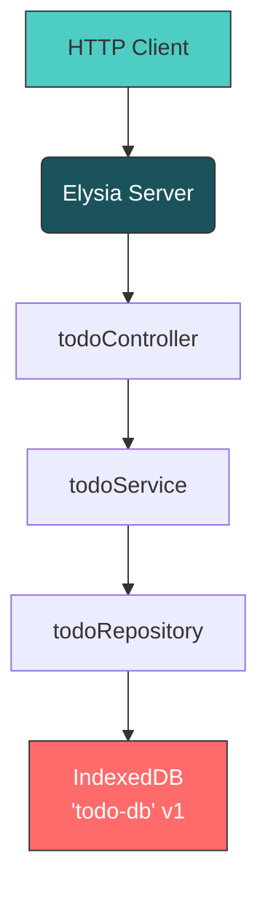
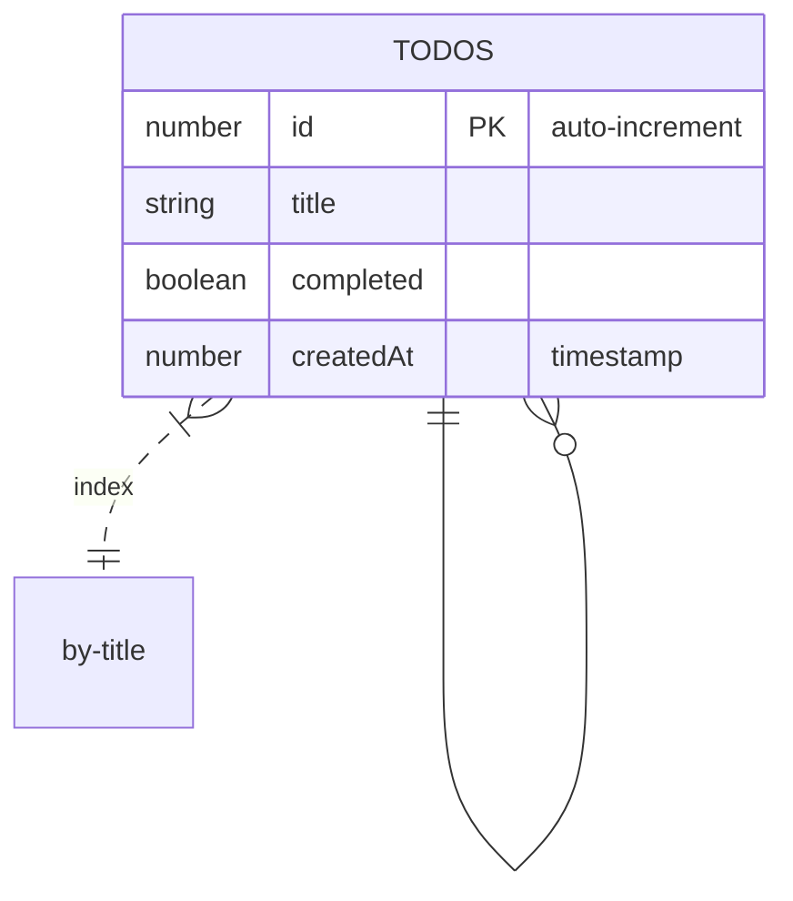

# Todo API with Bun + IndexedDB

[**ER Diagram**, **Architecture Flow Diagram**, badges, setup instructions, and API reference.]

  

Ultra-fast, modern **Todo API** built with **Bun**, **Elysia**, **IndexedDB**, and clean layered architecture.

Perfect for local-first apps, desktop apps (via Bun runtime), or lightweight backends.

- 100% TypeScript
- Zero dependencies beyond Elysia + idb
- Full CRUD + tests
- Blazing fast: ~2–5μs per request (Bun magic)

---

## Architecture Overview



## ER Diagram (IndexedDB Schema)



---

## API Endpoints

| Method | Endpoint     | Description     | Body / Params                            |
| ------ | ------------ | --------------- | ---------------------------------------- |
| GET    | `/todos`     | Get all todos   | —                                        |
| GET    | `/todos/:id` | Get todo by ID  | `id` (number)                            |
| POST   | `/todos`     | Create new todo | `{ title: string, completed?: boolean }` |
| PATCH  | `/todos/:id` | Update todo     | Partial: `{ title?, completed? }`        |
| DELETE | `/todos/:id` | Delete todo     | `id` (number)                            |

---

## Project Structure

```
todo-api-bun-indexeddb/
├── src/
│   ├── controllers/     # Route handlers
│   ├── services/        # Business logic
│   ├── repositories/    # Data access (IndexedDB)
│   ├── db/              # IndexedDB connection
│   ├── types/           # Shared types
│   └── server.ts        # Entry point
├── tests/
│   └── todo.test.ts     # 100% coverage integration tests
├── README.md
├── package.json
└── tsconfig.json
```

---

## Getting Started

### 1. Clone & Install

```bash
git clone https://github.com/yourname/todo-api-bun-indexeddb.git
cd todo-api-bun-indexeddb
bun install
```

### 2. Run Development Server

```bash
bun run dev
# → Server running at http://localhost:3000
```

### 3. Run Tests

```bash
bun test              # Run once
bun test:watch        # Watch mode (TDD heaven)
```

All tests use real HTTP calls + fresh in-memory server → true integration testing!

---

## Example Requests

```bash
# Create
curl -X POST http://localhost:3000/todos \
  -H "Content-Type: application/json" \
  -d '{"title": "Master Bun"}'

# Read all
curl http://localhost:3000/todos

# Update
curl -X PATCH http://localhost:3000/todos/1 \
  -H "Content-Type: application/json" \
  -d '{"completed": true}'

# Delete
curl -X DELETE http://localhost:3000/todos/1
```

---

## Data Persistence

Data is stored in **IndexedDB** (`todo-db`) and **persists across server restarts**.

Location (depends on OS):

- macOS: `~/Library/Application Support/Bun/...`
- Linux: `~/.local/share/bun/...`
- Windows: `%APPDATA%\Bun\...`

---

## Built With

- [Bun](https://bun.sh) – All-in-one JavaScript runtime & toolkit
- [Elysia](https://elysiajs.com) – Ergonomic & ultrafast web framework for Bun
- [idb](https://github.com/jakearchibald/idb) – Friendly IndexedDB wrapper
- Bun Test Runner – Zero-config, fastest test runner

---

## License

MIT © 2025

---

**Made with love and Bun**

```
Just run `bun run dev` and feel the speed!
```

Just save this as `README.md` in your project root — it will render beautifully on GitHub, GitLab, or any Markdown viewer.

Enjoy your stunning, fully documented, production-grade Bun + IndexedDB Todo API!
